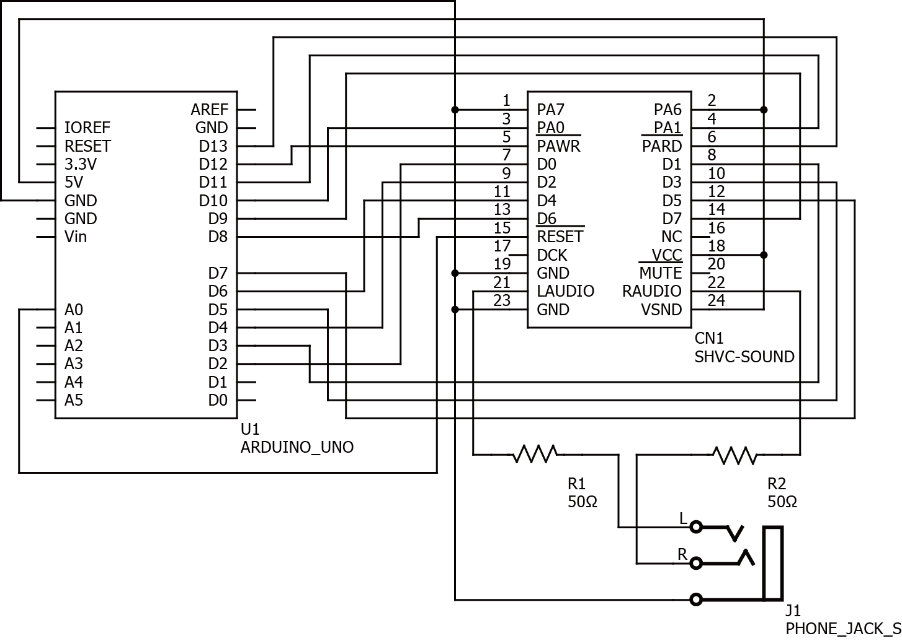

# SPCPlay

SPCPlay is SNES .spc player using Arduino Uno and SHVC-SOUND.

## Requirements

- Arduino Uno
- SNES audio unit(SHVC-SOUND)
- .NET Framework
- [Improvement version of SNESAPU.DLL](https://dgrfactory.jp/spcplay/index.html#snesapu)

## Schematic



## How to use SPCPlay.exe

First, copy SNESAPU.DLL to same directory as SPCPlay.exe .

Example: Play foobar.spc in Arduino (connected to COM10)

```
> SPCPlay.exe COM10 foobar.spc
```
